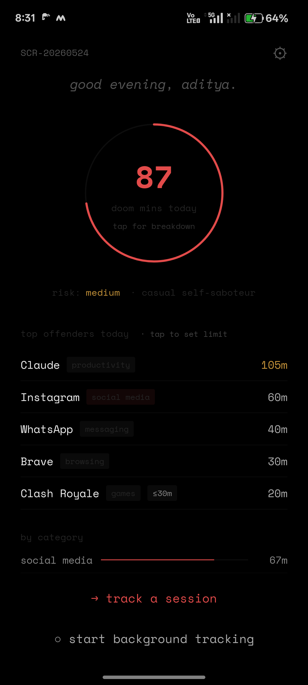
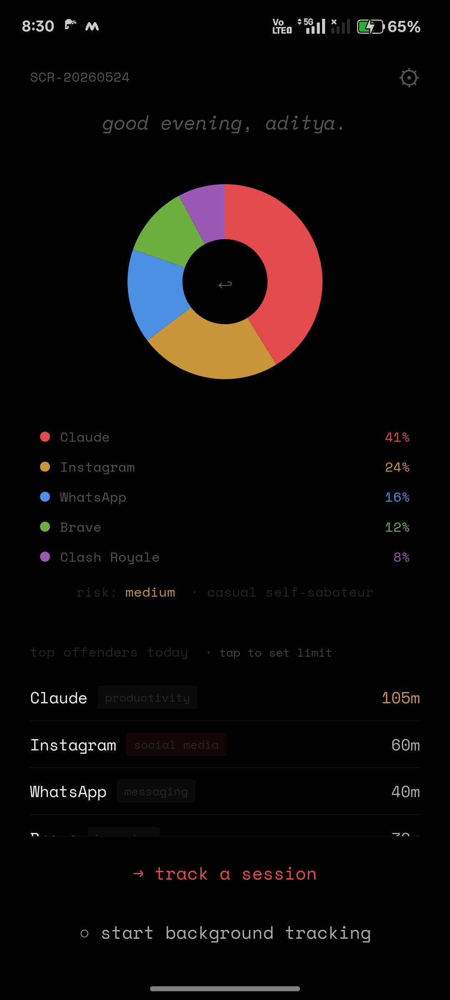
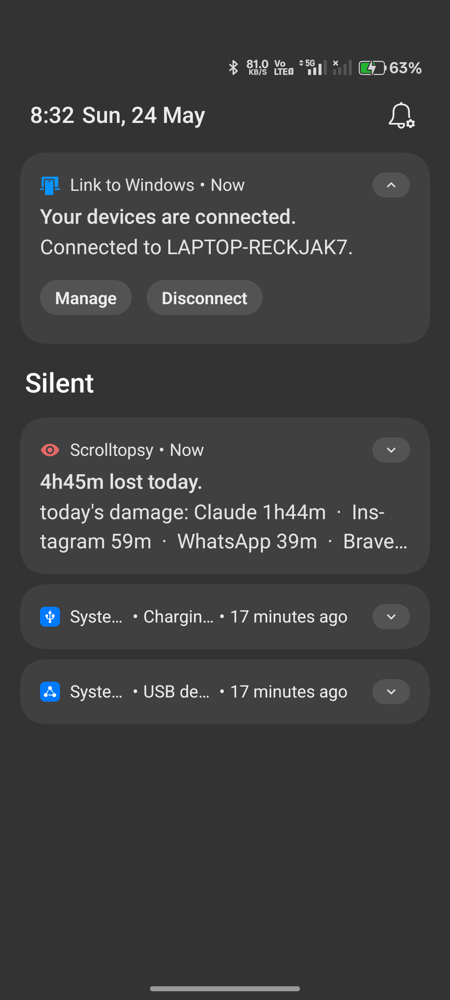

# scrolltopsy

a post-mortem of your scroll session.

## what it does

tap "i'm about to doomscroll" before opening a feed.  
tap "i'm done" when you surface.

scrolltopsy shows you exactly what you gave away — time per app, sessions, shame.

## demo

| home arc | pie breakdown | notification |
|----------|---------------|--------------|
|  |  |  |

tap the doom-mins circle to flip it into a per-app pie chart.  
tap any slice to see session times + shame message if you're over quota.

## install (android)

download the latest APK from [`releases/`](releases/) and sideload it:

```bash
adb install releases/scrolltopsy-v4.1.0.apk
# or just open the .apk file on your Android device
```

requires android 8+ (API 26). allow "install from unknown sources" if prompted.  
the APK is signed — any tampered copy will be rejected by android.

## build from source

### android

```bash
npm install
npm run build                        # bundle JS
npx expo export --platform android   # alternative bundler
cd android && .\gradlew.bat assembleRelease
```

requires: android SDK (`ANDROID_HOME`), NDK 27.1.12297006, JDK 17+, Node 18+.  
build from a short path (`C:\s3\`) — long paths exceed windows' 260-char limit.

you need a `android/key.properties` (not in repo — create from your keystore):

```
storeFile=../your-release.keystore
storePassword=yourpassword
keyAlias=youralias
keyPassword=yourpassword
```

### ios

> requires a mac with Xcode 15+ and an Apple Developer account ($99/yr).

```bash
npm install
npx expo run:ios          # development build (simulator or device)
```

for distribution (TestFlight / App Store):

```bash
npm install -g eas-cli
eas build --platform ios
```

**extra steps for iOS:**
1. in [Firebase console](https://console.firebase.google.com/) → your project → add iOS app → download `GoogleService-Info.plist` → place at `ios/scrolltopsy/GoogleService-Info.plist`
2. in [Google Cloud Console](https://console.cloud.google.com/) → APIs & Services → Credentials → create an **OAuth 2.0 Client ID** for iOS → add the bundle ID `app.scrolltopsy` → set as `iosClientId` in `src/lib/firebase.ts`
3. add the reversed client ID as a URL scheme in Xcode → Info → URL Types
4. `npx expo run:ios --device` to build on a real device

> **note:** the notification icon, usage-stats module, and background tracking service are android-only. on iOS, background tracking uses Screen Time API (not yet implemented) — the manual session timer works on both platforms.

## stack

vite + react + firebase + capacitor (web PWA)  
expo + react native + firebase + capacitor (android native)

## security

- APK signed with a private keystore (not in this repo)
- R8 minification + resource shrinking enabled in release builds
- HTTPS-only enforced via network security config (no cleartext traffic)
- firebase firestore rules require authentication for all writes
- no analytics, tracking pixels, or device fingerprinting
- no raw timestamps or device IDs leave the device
- firestore receives weekly aggregates only, encrypted with AES-256-GCM before upload
- `key.properties` and `google-services.json` are gitignored — never committed

## privacy

no analytics. no device ids. no raw timestamps leave the device.  
firestore receives weekly aggregates only.  
sign-in is optional. everything works without an account.
