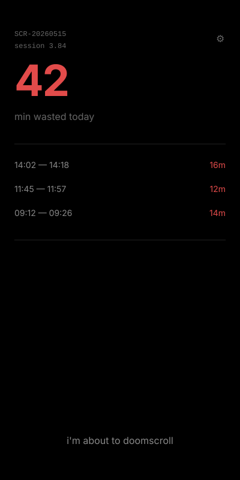
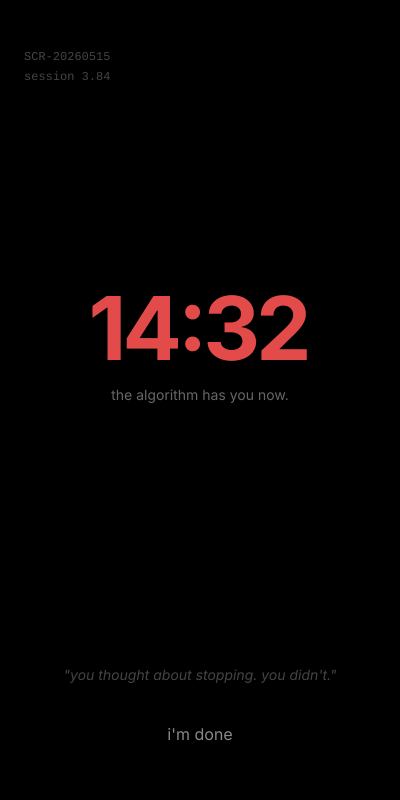
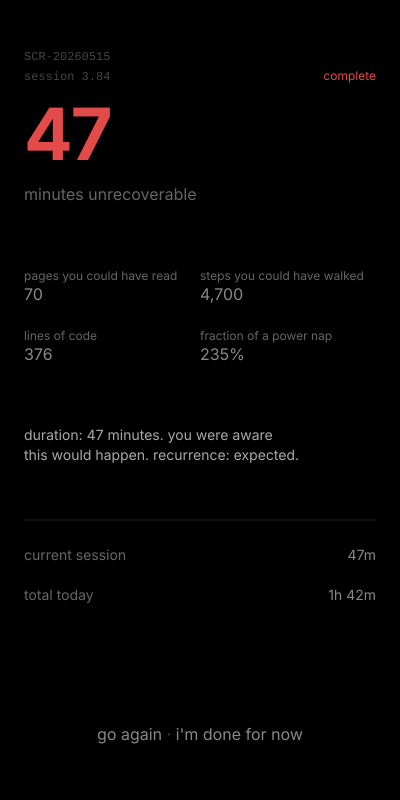

# scrolltopsy

**a post-mortem of your scroll session.**

not a blocker. not a timer. not a wellness app.  
a mirror — cold, clinical, and accurate.

---

<p align="center">
  
  &nbsp;&nbsp;&nbsp;&nbsp;
  
  &nbsp;&nbsp;&nbsp;&nbsp;
  
</p>

---

## what it does

you open a feed. you tap **i'm about to doomscroll**.  
you come up for air. you tap **i'm done**.

scrolltopsy tells you exactly what you gave away — in minutes, in pages you didn't read, in steps you didn't walk, in lines of code you didn't write.

no streaks. no encouragement. no notifications.  
just a number, and what that number cost you.

---

## the psychology

most screen time apps try to block or guilt-trip. both fail.  
blocking gets disabled. generic guilt is easy to dismiss.

scrolltopsy uses **shame through precision** — the only mechanism that actually works.

- **specificity** — "47 minutes" is harder to rationalise than "too long"
- **clinical framing** — a lab report is more unsettling than a warning label
- **identity labelling** — after 7 sessions, you're assigned a *scrolltype* based on your actual pattern
- **irreplaceable history** — your data accumulates. deleting the app means deleting your record.
- **variable shame** — 60+ rotating messages across 5 severity tiers. each session feels freshly judged.

the design enforces the psychology. no rounded buttons. no cards. no centered layouts.  
information exists directly on the dark background, like ink on paper.

---

## scrolltypes

after 7 sessions, the app classifies you:

| scrolltype | trigger |
|---|---|
| late-night doom merchant | most sessions between 10pm – 2am |
| morning anxiety checker | most sessions 6am – 9am |
| deep void diver | any single session over 45 minutes |
| compulsive refresher | more than 4 sessions per day on average |
| weekend void walker | most sessions on Saturdays or Sundays |
| casual self-saboteur | everything else |

---

## tech stack

| layer | technology |
|---|---|
| frontend | Vite + React + TypeScript |
| styling | Tailwind CSS |
| local data | localStorage + IndexedDB (iOS purge protection) |
| cloud sync | Firebase Firestore (optional, opt-in only) |
| auth | Firebase Auth — Google Sign-In |
| shame engine | 60+ static messages across 5 severity tiers |
| PWA | service worker + manifest — installable on iOS and Android |
| deployment | Vercel |

---

## privacy

scrolltopsy is designed from the ground up around one principle:  
**your data is yours. all of it.**

- all tracking is local — localStorage + IndexedDB on your device
- cloud backup is entirely opt-in — you tap a button in settings to enable it
- firestore receives only **weekly aggregates** — never individual session timestamps
- no analytics. no tracking pixels. no fingerprinting. ever.
- **delete all my data** wipes localStorage, IndexedDB, and Firestore simultaneously
- the app works 100% offline, forever, without signing in

```
what is NEVER stored anywhere:
  device identifiers · IP addresses · which platforms you scrolled
  content you viewed · precise session timestamps
```

---

## data architecture

```
layer 1 — localStorage + IndexedDB   always on · never leaves device
layer 2 — Firestore                  opt-in · weekly aggregates only
layer 3 — accountability token       opt-in · share weekly total with one person
                                     expires after 7 days · auto-deleted
```

---

## test coverage

```
Test Files  3 passed (3)
     Tests  43 passed (43)
  Duration  1.16s

storage.js     89.8% statement coverage
ai.js          62.8% statement coverage
firebase.js     0%   intentional — requires live Firebase connection
auth.js         0%   intentional — requires real OAuth flow
sync.js         0%   intentional — requires live Firestore
```

---

## local development

```bash
git clone https://github.com/Aditya1416/scrolltopsy.git
cd scrolltopsy
npm install
```

create `.env.local`:

```
NEXT_PUBLIC_FIREBASE_API_KEY=your_key
NEXT_PUBLIC_FIREBASE_AUTH_DOMAIN=your_domain
NEXT_PUBLIC_FIREBASE_PROJECT_ID=your_project_id
VITE_CLAUDE_API_KEY=your_claude_key
```

```bash
npm run dev
```

---

## running tests

```bash
npm test              # run all 43 tests
npm run test:coverage # with coverage report
```

---

## deployment

```bash
npm run build
```

deploy the `dist/` folder to Vercel.  
the service worker handles offline functionality automatically.

after deploying, add your production domain to Firebase → Authentication → Authorized Domains.

---

## install as a PWA

**android:** open in Chrome → install banner or ⋮ → Add to Home Screen  
**ios:** open in Safari → Share → Add to Home Screen

works offline after the first visit. full-screen, dark splash, no browser chrome.

---

## project structure

```
src/
├── lib/
│   ├── storage.js        local data layer (localStorage + IndexedDB)
│   ├── ai.js             shame dictionary + tier selection (60+ messages)
│   ├── firebase.js       firebase initialisation
│   ├── auth.js           google sign-in + delete account
│   ├── sync.js           firestore sync (weekly aggregates only)
│   └── accountability.js token generation + expiry
├── components/
│   ├── IdleHome.jsx      session log + start action
│   ├── Tracking.jsx      live timer (timestamp-based, backgrounding safe)
│   └── ShameReport.jsx   autopsy complete
├── integration/
│   └── flow.test.ts      end-to-end session flow tests
docs/
│   ├── screen_idle.svg
│   ├── screen_tracking.svg
│   └── screen_shame.svg
public/
├── sw.js                 service worker (manifest-driven chunk caching)
├── manifest.json         PWA config
└── .well-known/
    └── assetlinks.json   android TWA verification
firestore.rules
```

---

## license

MIT

---

<p align="center">
  <i>your attention was someone else's revenue. this week, check by how much.</i>
</p>
