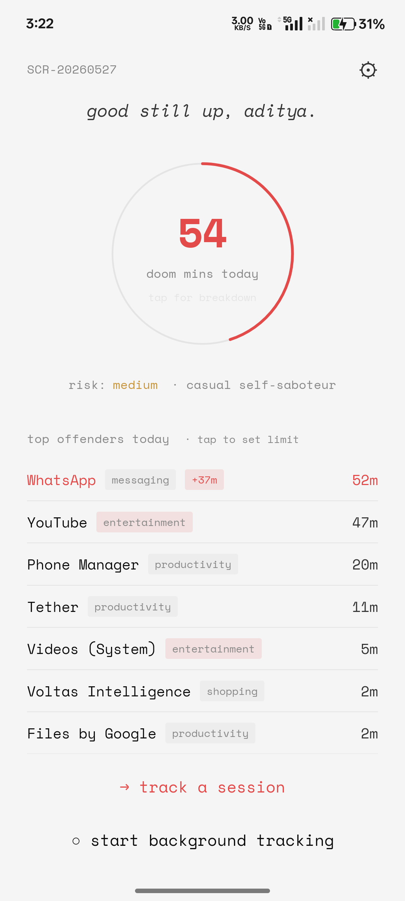
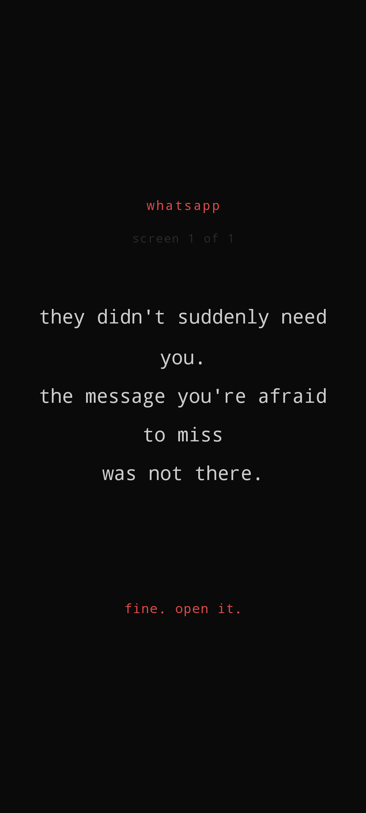

# scrolltopsy

a post-mortem of your screen time. tracks every doomscroll, blocks your worst apps, and shows you exactly how much of your life you gave away.

## screenshots

| home (light) | shame intercept |
|---|---|
|  |  |

tap the doom-mins arc to flip into a per-app pie chart.  
tap any slice to see individual sessions and a shame message if you're over quota.  
app-specific shame messages fire in ~65ms when you open a blocked app.

## features

### tracking
- **automatic background tracking** via Android UsageStats API — no manual input
- **manual session timer** — tap before you open a feed, tap when you surface
- **per-app session breakdown** — exact start/end times for each session today
- **doom arc** — animated circle showing today's total against a 2-hour reference
- **pie chart flip** — tap the arc to see your time split by app
- **risk level** — `low / medium / high` based on total doom minutes
- **scrolltype classification** — `late-night doom merchant`, `deep void diver`, `morning anxiety checker`, etc.

### blocking
- **force-stop blocking** — set a daily limit on any app; AccessibilityService intercepts every open
- **instant intercept** — shame screen appears in ~65ms via `TYPE_WINDOW_STATE_CHANGED`
- **app-specific shame messages** — 20+ categories (WhatsApp, Instagram, YouTube, TikTok, Reddit, Netflix, games, shopping, news, …)
- **shame gauntlet** — configurable number of screens to tap through before the app opens
- **3-minute grace period** — re-intercept after completing the gauntlet; prevents instant re-open
- **no-animation cover** — `FLAG_ACTIVITY_NO_ANIMATION` + `overridePendingTransition(0,0)` for zero-delay display
- **accurate app classification** — exact package→category lookup for 60+ apps, falls back to `ApplicationInfo.category` metadata, then substring matching
- **light/dark shame screen** — intercept screen matches your chosen app theme

### sharing & stats
- **share progress** — export today / week / month / year stats as formatted text
- **share from shame screen** — instantly share a session result after the autopsy

### account & profile
- **Google Sign-In** — native Android sign-in via Firebase
- **profile** — age, gender, birthday, phone, pincode, profile photo (stored locally only, never uploaded)
- **cloud backup** — sessions synced to Firestore as weekly aggregates on demand
- **privacy policy** — in-app screen, no external redirect

### i18n — 12 languages
English · **Hinglish** · हिन्दी · বাংলা · Español · Français · Deutsch · Português · 日本語 · 한국어 · 中文 · العربية

---

## install (android)

download from [`releases/`](releases/) and sideload:

```bash
adb install releases/scrolltopsy-v4.8.0.apk
```

or open the `.apk` directly on your Android device.

| build | arch | size |
|---|---|---|
| `scrolltopsy-v4.8.0.apk` | arm64-v8a (modern) | 29 MB |
| `scrolltopsy-v4.8.0-arm32.apk` | armeabi-v7a (older) | 23 MB |

requires **Android 8.0+** (API 26). allow "install from unknown sources" if prompted.  
APK is signed — tampered copies will be rejected.

### first-run permissions
1. **Usage Access** — Settings → Special app access → Usage access → Scrolltopsy → on
2. **Display over other apps** — required for the shame intercept screen
3. **Accessibility** — Settings → Accessibility → Scrolltopsy → on (required for instant blocking)

> **OPPO / OnePlus note:** After installing an APK update, ColorOS kills accessibility services. Go to Settings → Accessibility → Scrolltopsy and toggle it off and back on once after each update.

---

## build from source

### requirements

| tool | version |
|---|---|
| Node | 18+ |
| JDK | 17+ |
| Android SDK | API 35 (`compileSdk`) |
| Android NDK | 27.1.12297006 |
| Build Tools | 35.0.0 |

build from a **short path** (`C:\s3\`) — Windows has a 260-char path limit that breaks the NDK.

### steps

```bash
npm install
cd android && gradlew.bat assembleRelease
# APK at: android/app/build/outputs/apk/release/app-arm64-v8a-release.apk
```

### signing

create `android/key.properties` (not in repo):

```properties
storeFile=../your-release.keystore
storePassword=yourpassword
keyAlias=youralias
keyPassword=yourpassword
```

### firebase

- place `google-services.json` at `android/app/google-services.json` (gitignored)
- firestore rules: `firestore.rules` (in repo)

---

## architecture

```
src/
  lib/
    storage.ts          — AsyncStorage: sessions, profile, settings
    auth.ts             — Firebase auth (Google Sign-In)
    sync.ts             — Firestore weekly aggregate upload
    shame.ts            — context-aware shame message engine
    nativeModules.ts    — JS bridge to Android native modules
    behaviorEngine.ts   — usage analysis, risk scoring, scrolltype
    appCategories.ts    — package→category lookup (60+ apps)
  screens/
    HomeScreen.tsx      — doom arc, top offenders, quota management
    TrackingScreen.tsx  — manual session timer
    ShameScreen.tsx     — post-session autopsy
    SettingsModal.tsx   — account, backup, theme, language, share stats
    AccountModal.tsx    — profile (photo, age, gender, birthday, phone, pincode)
    PrivacyPolicyModal.tsx
  context/
    ThemeContext.tsx     — dark/light toggle, syncs to native SharedPrefs
  i18n/
    locales/            — 12 language files (en, hin, hi, bn, es, fr, de, pt, ja, ko, zh, ar)

android/app/src/main/java/app/scrolltopsy/android/
  BlockAccessibilityService.kt   — TYPE_WINDOW_STATE_CHANGED → intercept trigger
  ShameInterceptActivity.kt      — native shame screen, app classification, theme-aware
  BlockerModule.kt               — React Native bridge: blockApp, setForceStop, setTheme, …
  UsageStatsModule.kt            — usage events, per-app sessions, isUserApp fix
  TrackingService.kt             — foreground notification service
```

### shame message engine

`ShameInterceptActivity.kt` classifies by exact package name first (60+ entries), then substring, then `ApplicationInfo.category` from Android platform metadata. Falls back to generic messages. 20 category pools including WhatsApp, Instagram, TikTok, YouTube, Reddit, Netflix, streaming, Spotify, games, shopping, news, browsers, and social.

### theme sync

`ThemeContext.tsx` writes `theme_dark` to `scrolltopsy_blocks` SharedPreferences via `BlockerModule.setThemeDark()` on every toggle and on initial load. `ShameInterceptActivity` reads this at launch and renders dark (`#0a0a0a` / `#cccccc`) or light (`#f5f5f5` / `#1a1a1a`) accordingly.

---

## privacy

- no analytics, tracking pixels, or device fingerprinting
- no device identifiers (IMEI, advertising ID) stored or transmitted
- firestore receives **weekly aggregates only** (session count + total minutes)
- raw session timestamps never leave the device
- profile data (age, gender, birthday, phone, pincode, photo) stored locally only — never uploaded
- sign-in is optional; all features work without an account
- `key.properties` and `google-services.json` are gitignored

---

## security

- APK signed with a private keystore (not in repo)
- R8 minification enabled in release builds
- no cleartext traffic (network security config)
- Firestore rules require authentication for all writes
- `QUERY_ALL_PACKAGES` used only for app label lookup in blocking
- accessibility service runs in main process (no separate process isolation needed)

---

## changelog

### v4.8.0
- **Hinglish** language added (12th locale)
- **YouTube & pre-installed apps now tracked** — `isUserApp()` includes `FLAG_UPDATED_SYSTEM_APP` + `ApplicationInfo.category` + explicit allowlist
- **Shame screen follows app theme** — reads `theme_dark` from SharedPrefs; light/dark aware
- **Background tracking button** — instant optimistic UI update on tap
- **Profile photo** — pick from gallery via `expo-image-picker`, stored locally
- **Exact package classification** — 60+ exact package→category mappings before substring fallback
- `ApplicationInfo.category` used as final classification fallback for unknown apps
- `FLAG_ACTIVITY_NO_ANIMATION` + `overridePendingTransition(0,0)` for zero-delay block display
- `TYPE_WINDOWS_CHANGED` added to accessibility event subscription
- SharedPreferences cached on service connect (reduced I/O per event)

### v4.7.0
- App-specific shame messages for streaming, Spotify, audio, social, browser categories
- Diagnostic logging for block pipeline (removed in v4.8.0)

### v4.6.0
- **Critical fix**: `handleQuotaSet` now calls `blockApp()` — new users were never intercepted
- Grace period extended from 30s to 3 minutes
- Profile modal: age, gender, birthday, phone, pincode
- Privacy policy moved in-app (no Vercel redirect)
- Share stats from settings (today/week/month/year)
- Share from shame screen

### v4.5.0
- `clearGauntlet()` native method added
- `forceStop` flag wired to AccessibilityService intercept

### v4.3.0
- AccessibilityService real-time blocking
- YouTube tracking fix
- Bengali locale
- 11 languages total

### v4.0.0
- Complete React Native rewrite
- Native Android modules (UsageStats, TrackingService, AppBlocker, OverlayPermission)
- Firebase auth (native Google Sign-In)
- Background tracking foreground service

---

## license

MIT
